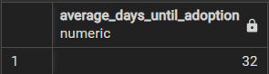

# Animal Shelter (Austin, Texas)

## Data Source: [Animal Shelter Analytics](https://www.kaggle.com/datasets/jackdaoud/animal-shelter-analytics?select=Austin_Animal_Center_Intakes.csv) (10/01/2013 - 03/03/2021)

This dataset is from Kaggle. It contains 3 CSVs:
1. Austin_Animal_Center_Intakes.csv: The status of animals as they arrive at the Animal Center.
2. Austin_Animal_Center_Outcomes.csv: The status of animals as they leave the Animal Center.
3. Austin_Animal_Center_Stray_Map.csv: Map data that shows all stray cats/dogs that are currently listed in AAC's database for no longer than a week. (Not going to use this becuase it only has 16 rows)

## 5 Questions
1. What are the top 3 most common names for dogs and cats per sex? 
2. What are the 3 most common breeds for stray intakes?
3. What are the top 2 common outcomes (adoption, transfer, etc.) for each animal type?
4. Top 10 year and month that has the most intakes.
5. What is the average time between intake and adoption?

## Answers
1. 

2. The top 3 most common breeds for stray intakes are Domestic Shorthair Mix, Pit Bull Mix, and Domestic Shorthair.

3. 

4. Seems like the animal shelter receives the most intakes in May or June.

5. The average time between intake and adoption is 32 days.

## Visualizations
[Tableau Public](https://public.tableau.com/views/AnimalShelter10012013-03032021/MostCommonNamesforCatsandDogsperSex?:language=en-US&publish=yes&:display_count=n&:origin=viz_share_link)

<noscript></noscript><object class='tableauViz'  style='display:none;'><param name='host_url' value='https%3A%2F%2Fpublic.tableau.com%2F' /> <param name='embed_code_version' value='3' /> <param name='site_root' value='' /><param name='name' value='AnimalShelter10012013-03032021&#47;MostCommonNamesforCatsandDogsperSex' /><param name='tabs' value='yes' /><param name='toolbar' value='yes' /><param name='static_image' value='https:&#47;&#47;public.tableau.com&#47;static&#47;images&#47;An&#47;AnimalShelter10012013-03032021&#47;MostCommonNamesforCatsandDogsperSex&#47;1.png' /> <param name='animate_transition' value='yes' /><param name='display_static_image' value='yes' /><param name='display_spinner' value='yes' /><param name='display_overlay' value='yes' /><param name='display_count' value='yes' /><param name='language' value='en-US' /><param name='filter' value='publish=yes' /></object>
               

