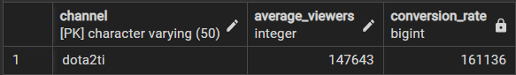

# Top Streamers on Twitch

## Data Source: [Top Streamers on Twitch](https://www.kaggle.com/datasets/aayushmishra1512/twitchdata)

This dataset is from Kaggle and it contains the top 1000 streamers/channels data from 2019.

Features:
- Channel: channel name 
- Watch time (minutes)
- Stream time (minutes)
- Peak viewers
- Average viewers
- Followers
- Followers gained: followers gained in 2019
- Views gained: views gained in 2019
- Partnered: twitch partnered or not
- Mature: 18+ Stream or not
- Language

## 5 Questions
1. What are the top 5 channel with the highest watch time descending?
2. Which channel has the highest stream time to watch time conversion rate? (In other words, how many watch time generated per stream time in minutes)
3. Find the top 5 count of channels per language.
4. What are the top 10 channels with the highest peak viewers and their gap in viewers to the previous channel?
5. Find top 10 channels that gained the most followers in percentage with at least 1 million followers?

## Answers
1. xQcOW, summit1g, Gaules, ESL_CSGO, and Tfue have the highest watch time (minutes) in 2019.

2. dota2ti has the highest conversion rate. Every minute of stream will generate about 161136 minutes of watch time.

3. English, Korean, Russian, Spanish, and French are the most common languages by the top 1000 streamers/channels.

4. Riot Games has the most peak viewers in 2019, I believe the League of Legends world championship attracted a lot of viewers.

5. These 10 streamers/channels gained the followers in percentage in 2019.

